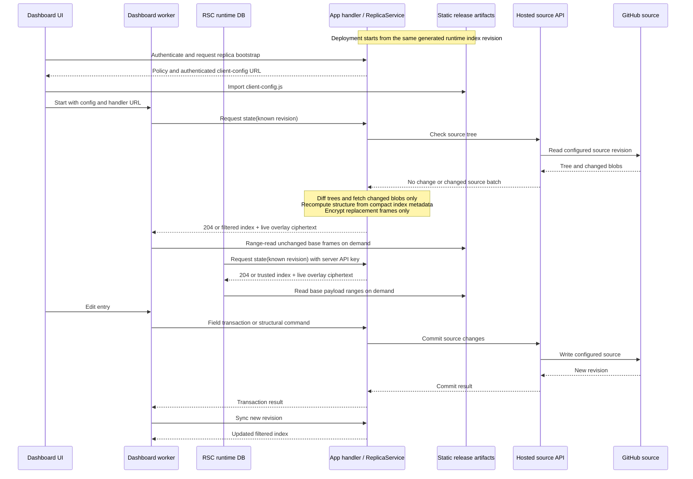
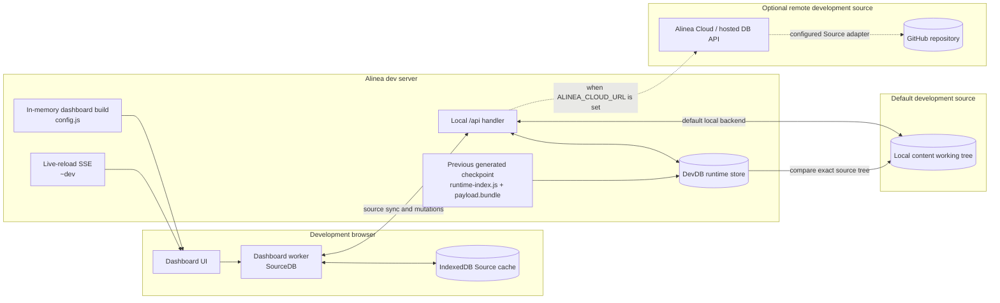

# Database synchronization flows

This document shows where database state lives and which process performs work
in development and production. The runtime format itself is described in the
[database architecture](./README.md).

## Production

The generated runtime index and base payload are immutable deployment
artifacts. The application handler is the authenticated coordination point: it
evaluates policy, refreshes its source view, accepts writes, and publishes live
runtime overlays. The dashboard worker and each RSC process own independent
runtime stores and decoded caches.

```mermaid
flowchart LR
  subgraph browser[Dashboard client]
    dashboard[Dashboard UI]
    worker[Dashboard worker<br/>ReplicaDashboardDB]
    browserCache[(IndexedDB serialized<br/>replica state)]
    dashboard --> worker
    worker <--> browserCache
  end

  subgraph app[Deployed application]
    rsc[RSC route<br/>local runtime DB]
    handler[Authenticated handler<br/>ReplicaService]
    serverIndex[@alinea/generated<br/>runtime-index.js]
    clientConfig[Static authenticated capability<br/>client-config.js]
    payload[Static encrypted release<br/>payload.bundle]
    handlerStore[(Handler runtime store<br/>live overlays)]
    serverIndex --> rsc
    serverIndex --> handler
    clientConfig --> worker
    payload --> worker
    payload --> rsc
    handler <--> handlerStore
  end

  subgraph hosted[Hosted source service]
    sourceApi[Alinea Cloud / hosted DB API]
  end

  subgraph source[Configured durable source]
    github[(GitHub repository)]
  end

  worker <-->|bootstrap, filtered index,<br/>live ciphertext, mutations| handler
  rsc <-->|trusted index refresh,<br/>live ciphertext| handler
  handler <-->|tree, changed blobs, commits| sourceApi
  sourceApi -.->|configured Source adapter| github
```

The normal production sequence is:



Important boundaries:

- The dashboard receives only the policy-filtered index rows and decode keys it
  may read. The RSC route authenticates with the server API key and receives the
  trusted server view.
- A state response contains index data plus only the encrypted entry-sized live
  bundles referenced by that authorized view. Their parsing and decryption stay
  lazy; the large base payload is never included.
- Unchanged base frames come from static hosting. Carrying live ciphertext with
  replica state avoids depending on handler-instance affinity until a later
  deployment or compaction folds those changes into a new base.
- The public payload is ciphertext. Possession of its URL does not grant read
  access without the per-entry keys in an authorized index view.
- A hosted database can use GitHub as its configured durable `Source`; the
  handler talks to the hosted source API rather than to GitHub directly.
- Live overlays are instance-independent because their ciphertext travels with
  replica state. Content and structural changes use the same tree-diff
  reconciler and retain unchanged frame descriptors.

## Development

Development favors immediate source editing and live reload over immutable
release artifacts. The dev server owns the current generated config and
`DevDB`. Its handler is backed directly by the local Git working tree unless
`ALINEA_CLOUD_URL` selects the hosted source service.



On startup, the dev server opens the last compatible generated index and
payload as a checkpoint. It then compares the checkpoint's exact source tree to
the working tree. An unchanged tree needs no entry reads or normalization;
changed files become the same in-memory entry overlays used by the production
handler. Additions, deletions, moves, and status changes are reconciled without
opening unchanged payloads. Only a missing or config-incompatible checkpoint
requires a full build. Filesystem fingerprints persisted
alongside the development checkpoint let this comparison stat unchanged files
without rereading and hashing their contents.

On a config or content rebuild, the dev server either asks the dashboard to
refetch database state or reloads the browser when the client bundle changed.
The browser worker may independently boot from its IndexedDB Source cache. If
that raw Source is all it has, it parses those files once to produce the same
runtime index and frames used everywhere else; it does not construct or retain a
second normalized database. Persisting the runtime checkpoint in this
development-only browser path is a possible follow-up optimization.

## Revision ownership

| State                   | Producer                           | Consumers                       | Transfer behavior                                                      |
| ----------------------- | ---------------------------------- | ------------------------------- | ---------------------------------------------------------------------- |
| Generated base index    | Build                              | RSC, handler, dashboard replica | Inline server import; filtered over replica state API                  |
| Generated base payload  | Build                              | RSC and dashboard replica       | Lazy static file or HTTP range reads                                   |
| Live runtime index      | Handler                            | RSC and dashboard replica       | `204` when unchanged; currently a complete filtered index when changed |
| Live overlay payload    | Handler                            | RSC and dashboard replica       | Authorized ciphertext travels with state; decoding remains lazy        |
| Durable source revision | Local Git or hosted source service | Handler and dev server          | Tree comparison followed by changed-blob reads                         |
| Decoded entries         | Each consuming process             | Queries in that process         | Retained in its local hot cache; never synchronized as objects         |
